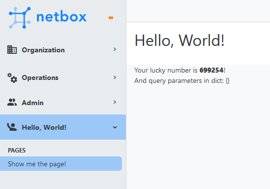

# NetBox Hello World Page Plugin

This is a small plugin to demonstrate showing non-model information
in the NetBox GUI.




## Installation

```
sudo /opt/netbox/venv/bin/pip install git+https://github.com/markkuleinio/netbox-hello-world-page
echo git+https://github.com/markkuleinio/netbox-hello-world-page | sudo tee -a /opt/netbox/local_requirements.txt
```

Add the plugin in the NetBox configuration in `/opt/netbox/netbox/netbox/configuration.py`:

```
PLUGINS = ["netbox_hello_world_page"]
```

Restart NetBox:

```
sudo systemctl restart netbox netbox-rq
```


## Features

- Has a menu item in the main NetBox menu (can be removed if not needed)
- Has a view (page) that can be populated from whatever data (see `views.py`)
- The output is rendered using a Django template (see the `templates` directory)
- The view has restricted permissions by default (can be removed if not needed): must have
View access to prefixes to see the page
- The view can be directly linked as `https://your-netbox-server-address/plugins/helloworld/helloworldpage/`
- URL parameters can be added and inspected (handy if using the view in custom links)
